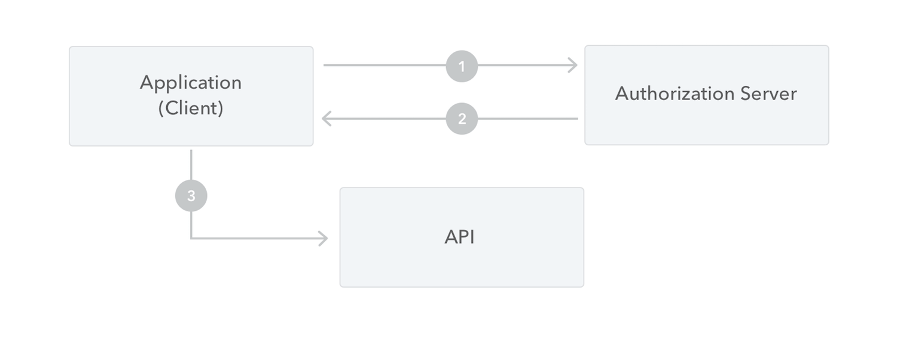

# Client access token

## Overview

Client access tokens are used to secure API endpoints that require more robust authentication than [client identification](./client-identification.md) between two _backend_ systems.

Before accessing an API endpoint like this, a client needs to obtain a client access token using its credentials (the client id and secret) from publiq's authorization server.



1. The client makes a request to the authorization server. It sends its client `id` and client `secret`, along with the required `audience` needed to access the API. All publiq APIs currently share the same audience: `https://api.publiq.be`.

2. The authorization server validates the request and, if successful, sends a response with an access token.

3. The client can now use the access token to call the API by using the obtained access token as a `Bearer` token in the `Authorization` header.

<!-- theme: warning -->

> ##### Security warnings ⚠️
> - ✅ **Always** request a client access token from a **backend** application
> - ❌ **Never** use or expose your client access token from a **frontend** application
>
> If you use or store your client secret or client access token in a frontend application they can be **stolen** and **abused** and your client will get blocked!
>
> If you need to do API calls from a frontend application, use [client identification](./client-identification.md) or a [user access token](./user-access-token.md) depending on what the API endpoint requires.

<!-- theme: info -->

> ##### Auth0
> publiq currently uses [Auth0](https://auth0.com/) as the implementation of its authentication and authorization service. For more in-depth information about client access tokens, please refer to the [Auth0 documentation](https://auth0.com/docs/flows#client-credentials-flow).

Read on below to see a concrete example of how to get a client access token for your client credentials.


## Example flow

To obtain a client access token, send a `POST` request to the `/oauth/token` endpoint of the authentication server for the test or production environment with a JSON body like this:

```http
POST /oauth/token HTTP/1.1
Host: https://account-test.uitid.be
Content-Type: application/json

{
  "client_id": "YOUR_CLIENT_ID",
  "client_secret": "YOUR_CLIENT_SECRET",
  "audience": "https://api.publiq.be",
  "scope": "https://api.publiq.be/auth/uitpas https://api.publiq.be/auth/uitdatabank-entry"
  "grant_type": "client_credentials"
}
```

In this example we're requesting a token with permission to access the UiTPAS API and the UiTdatabank Entry API. See [scopes](./scopes.md) for more info.

The possible hosts for the authentication servers are:
- Testing environment: `https://account-test.uitid.be`
- Production environment: `https://account.uitid.be`

<!-- theme: info -->

> ##### Environments
> Every publiq API has a testing and production environment. **Initially when building your integration, you should connect to the testing environment** of the APIs that you integrate with.
> 
> These different environments will require client access tokens from the respective testing and production environments of the authorization service.
> 
> Additionally, **your client id and secret will be different** for the testing environment and production environment.

After sending your request to the correct environment for your client credentials, you will get a response with a JSON body like this:

```http
HTTP/1.1 200 OK

{
 "access_token": "YOUR_ACCESS_TOKEN",
 "scope": "https://api.publiq.be/auth/uitpas https://api.publiq.be/auth/uitdatabank-entry"
 "expires_in": 86400,
 "token_type": "Bearer"
}
```

You can then include the returned access token as a [Bearer token](https://swagger.io/docs/specification/authentication/bearer-authentication/) in the `Authorization` header of your requests:

```http
GET /example HTTP/1.1
Host: https://api.uitpas.be
Authorization: Bearer YOUR_ACCESS_TOKEN
```

<!-- theme: success -->

> ##### Caching tokens
> Make sure to **cache and reuse** the obtained client access token for as long as possible. Do not request a new access token for each API request you make. The expiration time of a client access token is usually 24 hours. 
> 
> The response with your access token will include an `expires_in` parameter with the exact expiration time in seconds. You can make your cached token expire after that time has elapsed and request a new one then. Another option is to not look at the expiration time and request a new token as soon as you get a `401` response from an API, indicating that the token has expired.


## Try it out!

You can use the request form below to request a client access token using your client id and secret for the test environment. You can then use the `access_token` from the response body to authorize other example requests to the test environment in the documentation.

Make sure to set your **client id** and **secret** in the **body** tab!

```json http
{
  url: 'https://account-test.uitid.be/oauth/token',
  method: "POST",
  headers: {
    "content-type": "application/json"
  },
  body: {
    "client_id": "YOUR_CLIENT_ID",
    "client_secret": "YOUR_CLIENT_SECRET",
    "audience": "https://api.publiq.be",
    "grant_type":"client_credentials"    
  }
}
```