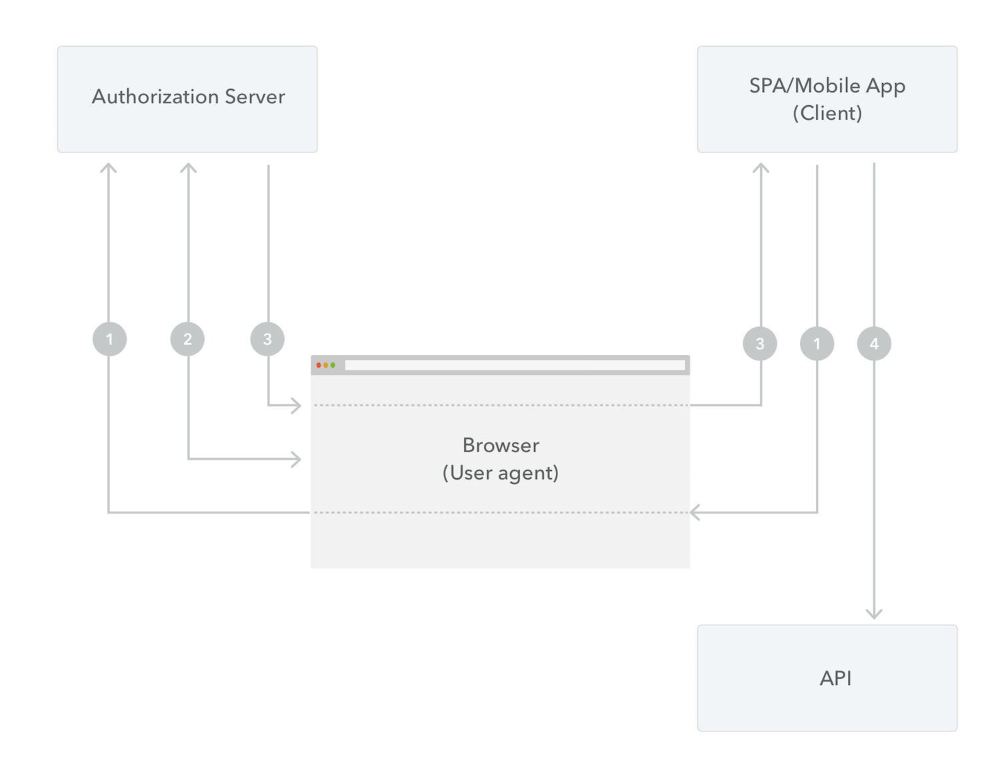

# User access token

<!-- theme: danger -->

> ##### References, remove before merge!
> - https://confluence.uitdatabank.be/display/UITIDV2/Authorize+publiq+APIs+using+Auth0+acces+token
> - https://confluence.uitdatabank.be/display/UITIDV2/How+to+integrate+UITIDv2+authentication+%28Auth0%29+in+your+project
> - https://auth0.com/docs/architecture-scenarios/spa-api
> - https://auth0.com/docs/api/authentication#authorization-code-flow
> - https://auth0.com/docs/authorization/configure-silent-authentication

## Overview

\[To do: document what the difference is between a regular web application and a frontend application\]

> ##### Auth0
> publiq currently uses [Auth0](https://auth0.com/) as the implementation of its authentication and authorization service. This page gives an overview of how to obtain a user access token via Auth0, but for some details the Auth0 documentation will be linked in case you require more information.

## Regular web applications

\[To do\: Document]

## Frontend applications (SPA)

Applications that only have a frontend, typically single-page-applications (SPA) in Javascript, can obtain a user access token using the [implicit grant flow](https://auth0.com/docs/architecture-scenarios/spa-api/part-1#implicit-grant) on the authorization server.

This flow does not require a client secret like the authorization flow for regular web applications does, and is thus safe to be used from a frontend application. It consists of 4 steps:

1. Your app initiates the flow and redirects the browser to an URL on the authorization server where the user can authenticate.

2. The user logs in or creates an account on the authorization server.

3. The authorization server redirects the user back to your app with an access token in the hash fragment of the URI. Your app can now extract the token from the hash fragment.

4. Done! Your app can now use the access token to call the API on behalf of the user. 🎉

### Redirecting to the authorization server

\[To do\: Document concrete info like URLs of the servers, correct path, what parameters to include]

- production: https://profile.uitid.be ?
- testing: ?

- audience `https://api.publiq.be`
- [scope](./scopes.md)
- redirect_uri (+ how to configure? contact?)
- client_id
- response_type `id_token token`
- state ?
- prompt `none` ?
- ... see https://auth0.com/docs/api/authentication#authorize-application

### Storing tokens

\[To do\: Document not to store token in cookie/localStorage but use silent login?]
